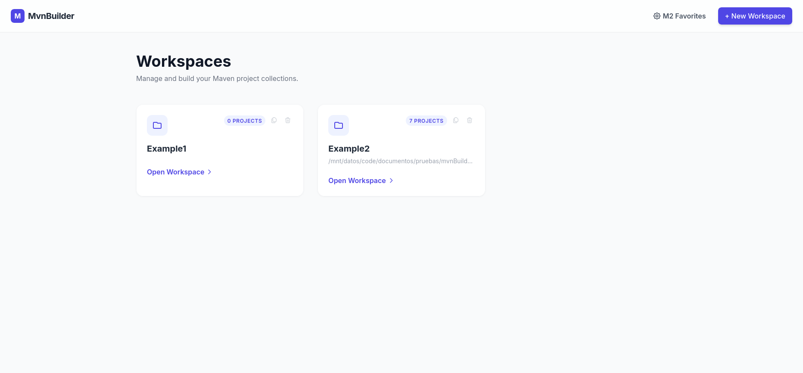
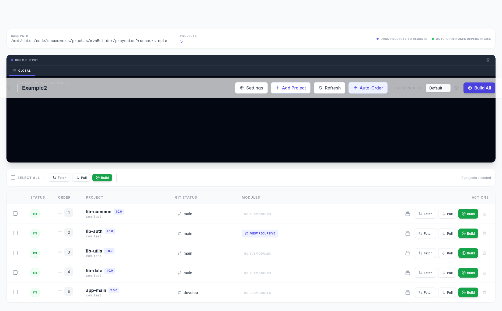

# MvnBuilder - Maven Workspace Manager & Builder

MvnBuilder is a robust administrative dashboard designed to manage complex Maven project structures. It provides a centralized interface for discovering projects, managing dependencies, executing builds with custom profiles, and maintaining the local M2 repository.

## 🚀 Key Features




### 🛠️ Advanced Build Management
- **Multiple Build Profiles**: Define and store custom Maven commands (e.g., `-B clean install`, `-B package -DskipTests`). Switch between profiles instantly with a single click.
- **Real-time Log Streaming**: Watch your build progress live via WebSockets.
- **Process Control**: Monitor the active process **PID**, see the exact **execution duration**, and **terminate (Kill)** any running build if needed.
- **Topological Sorting**: Automatically calculates the correct build order based on project dependencies, ensuring parent projects wait for children.




### 🧹 M2 Repository Maintenance
- **Physical Folder Discovery**: Scans your `~/.m2/repository` to find actual physical parent folders (Group IDs).
- **Targeted Deletion**: Select specific repository branches to delete recursively, helping you clean up corrupted artifacts or free up space without wiping the entire repository.
- **Favorites**: Mark frequently cleaned Group IDs as favorites for quick access.

### 📂 Workspace Organization
- **Project Discovery**: Automatically finds Maven projects within a base path.
- **Bulk Actions**: Perform Git Fetch, Pull, or Maven Build on multiple selected projects simultaneously.
- **Drag & Drop Reordering**: Manually override the build order using an intuitive interactive list.

---

## 🤖 Built with AI

This project is a testament to the power of modern Agentic AI. It was developed entirely through pair programming with **Antigravity**, utilizing a state-of-the-art multi-model orchestration:

- **Gemini 3.1 Pro**: Orchestration, complex logic refactoring, and architectural design.
- **Gemini 3 Flash**: Rapid iteration, UI polish, and routine coding tasks.
- **Claude 4.6 Opus**: High-precision debugging and complex algorithmic optimizations.

---

## 🛠️ Technology Stack

- **Backend**: Spring Boot 3.2.5 (Java 21)
- **Data Layer**: Spring Data JPA with H2 Database
- **Frontend**: Thymeleaf, Tailwind CSS, HTMX
- **Real-time**: WebSockets with STOMP & SockJS
- **Build System**: Maven (Native support for GraalVM)

---

## 🏁 Getting Started

### Prerequisites
- Java 21+
- Maven 3.9+

### Default Port
The application runs on port **3333** by default. You can change this by setting the `SERVER_PORT` environment variable or modifying `src/main/resources/application.properties`.

### 🚀 Running the Application

#### 1. Standard Java JAR
```bash
java -jar target/mvn-builder.jar
```

#### 2. Native Binary (Linux/macOS/Windows)
```bash
# Linux/macOS
./mvn-builder

# Windows
mvn-builder.exe
```

#### 3. Docker Compose (Recommended)
Download the `docker-compose.yml` file and run:
```bash
curl -O https://raw.githubusercontent.com/jonolabarrieta/maven-builder-web-ui/main/docker-compose.yml
docker compose up -d
```
*Note: This will use the image from GHCR and persist data in `./data`.*

#### 4. Docker Run
```bash
docker run -d \
  -p 3333:3333 \
  -v $(pwd)/data:/app/data \
  -v $(pwd)/workspaces:/workspaces \
  ghcr.io/jonolabarrieta/maven-builder-web-ui:latest
```

### Development Mode
```bash
./run.sh
```
The application will be available at `http://localhost:3333`.

---

## 📄 License

Licensed under the **Apache License, Version 2.0**. See the [LICENSE](LICENSE) file for details.

---

*Crafted with precision by net.olaba & Antigravity AI.*

## References

Agents document is based on the guidelines found at [Agents.md for Java and Spring Boot](https://josealopez.dev/en/blog/agents-md-java-spring-boot).
